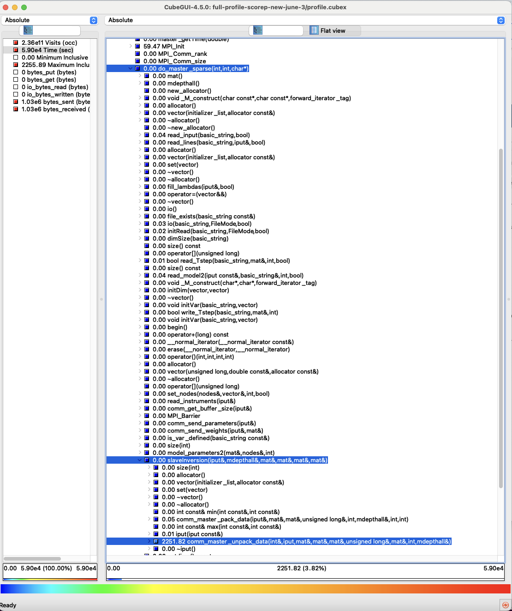
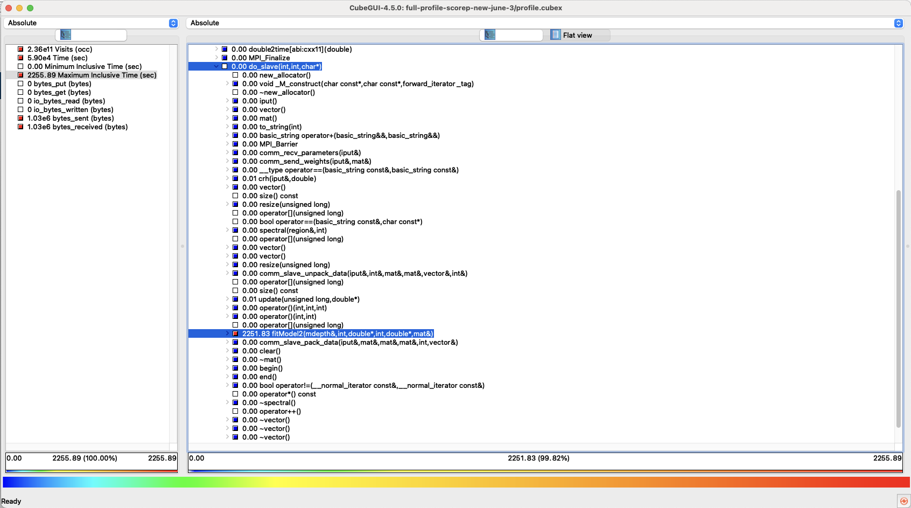
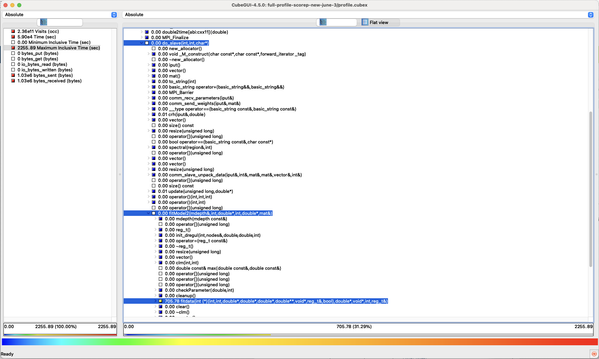
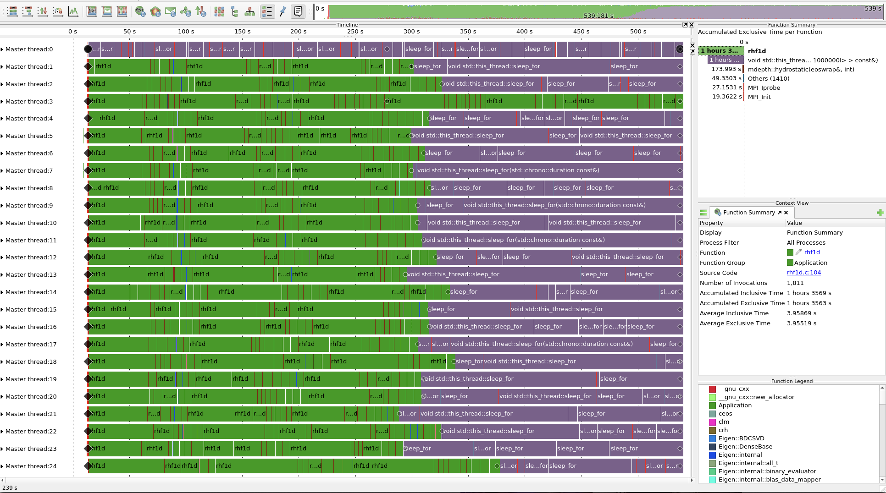
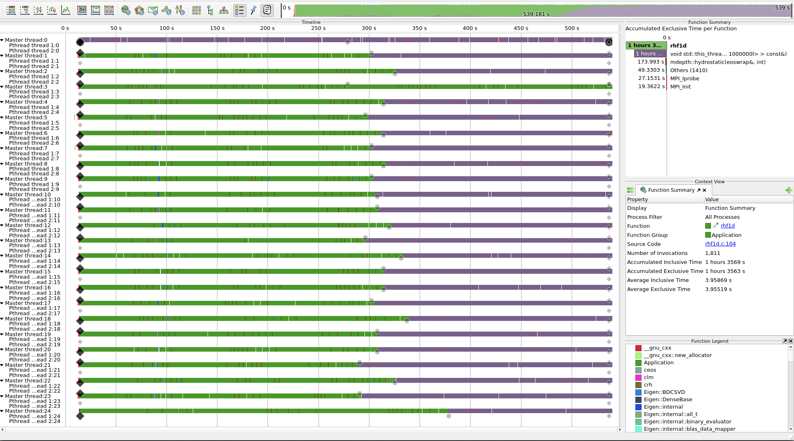
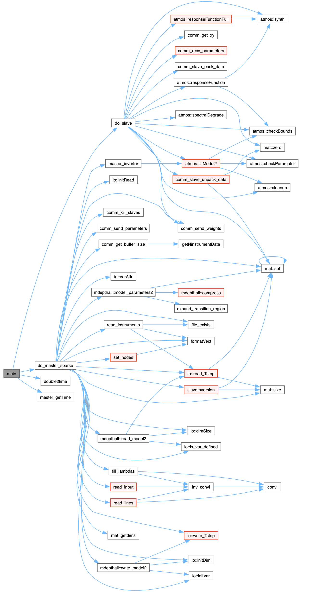

# Daily Progress Log

## Date: 05/06/2025

### Accomplishments
- [x] Continue investigating profile using CUBE
    - First, general view of STiC profile below:
    
    - Detailed Master process view. **Master basically only communicates...**
    
    - Detailed Worker process view 1 level below simply **do_slave**. Here we can see that basically there is **only really one function called fitModel2(mdepth&, int, double*, int, double*, mat&) that takes any execution time**
    
    - Detailed Worker process view 1 level below **fitModel2**. Here we can see that **the dominating next function is fitdata(int (*)(int, int, double*, double*, double*, double\*\*, void*, reg_t&, bool), double*, void*, int, reg_t&)**
    
    
### Challenges
- 

### Learnings
- 


## Date: 04/06/2025

### Accomplishments
- [x] Investigate stic profile:
    - Two key functions:
        - do_master_sparse(int, int, char*)
        - do_slave(int, int, char*)
    - The functions above call many other small functions but they are basically the core of the program. Need further tracing for more details.


### Challenges
- 

### Learnings
- 


## Date: 03/06/2025

### Accomplishments
- [x] Recompile STiC with modified makefile to improve traces.
    - New Makefile"
```
# Paths
GSLPATH        = /usr
INCLUDE_DIRS   = -I/usr/include -I./ -Irh/ -Irh/rh_1d -I/usr/include/tirpc -Ieigen3/
LIB_DIRS       = -L/usr/lib/x86_64-linux-gnu -L/usr/lib/ -L./ -Lrh/rh_1d/ -L/usr
LIBS           = -lnetcdf_c++4 -lnetcdf -lstdc++ -ltirpc -lrhf1d -lfftw3 -ltirpc -lgfortran -lm -lpthread

# Compiler & flags
CC             = scorep mpicxx
FC             = scorep gfortran
CXXFLAGS       = -O3 -march=native -g3 -std=c++11
FFLAGS         = -O3 -march=native -g3 -std=legacy

# Score-P config flags
SCOREP_FLAGS   = --thread=pthread --mpp=mpi --io=posix --nocuda --noopencl --noopenacc --memory --nokokkos --nohip

# Sources
FFILES         = eos_math_special.f eos_eqns.f eos.f
CXXFILES       = input.cc clm.cc cop.cc witt.cc ceos.cc comm.cc depthmodel.cc spectral.cc fpigen.cc \
                specrebin.cc specprefilter.cc fpi.cc atmosphere.cc clte.cc crh.cc io.cc slave.cc \
                master_sparse.cc main_sparse.cc

# Objects
FOBJS          = $(FFILES:.f=.o)
CXXOBJS        = $(CXXFILES:.cc=.o)
OBJS           = $(FOBJS) $(CXXOBJS)

# Default target
all: stic

%.o: %.f
        $(FC) $(FFLAGS) -c $< -o $@

%.o: %.cc
        $(CC) $(CXXFLAGS) $(INCLUDE_DIRS) -c $< -o $@

#stic: $(OBJS)
#       mpicxx -o $@ $(OBJS) $(INCLUDE_DIRS) $(LIB_DIRS) $(LIBS) \
#           `scorep-config $(SCOREP_FLAGS) --ldflags` \
#           -Wl,-start-group \
#           `scorep-config $(SCOREP_FLAGS) --event-libs` \
#           `scorep-config $(SCOREP_FLAGS) --mgmt-libs` \
#           -Wl,-end-group

stic: $(OBJS)
        $(CC) -o $@ $(OBJS) $(INCLUDE_DIRS) $(LIB_DIRS) $(LIBS)

clean:
        rm -f *.o *.mod stic
```
- [x] Running STIC with new scorep.
- [x] Adding scripts folder to work on new filters for stic.

### Challenges
- 

### Learnings
- 


## Date: 02/06/2025

### Accomplishments
- [x] New version of STiC filter this time adding all MPI calls.
[Improved filter including MPI calls](trace-screenshots/scorep-filter-exclude-all-include-low-maxbuf-include-MPI.txt) 


### Challenges
- 

### Learnings
- 


## Date: 30/05/2025

### Accomplishments
- [x] Improved filter for STiC
[First improved filter](trace-screenshots/scorep-filter-exclude-all-include-low-maxbuf.txt) 

### Challenges
- 

### Learnings
- 

## Date: 29/05/2025

### Accomplishments
- [x] Prepare a filter for Score-P to avoid gigantic traces... Finally I have a working one but still needs a lot of work...
    - First Vampir timeline screenshot of STiC. A few notes:
        - It seems the Master does not do any work.
            - Thus, one should use **N+1 number of ranks** where N is the maximum for ranks for a given input. That is because the master does not do work.
        - Different ranks seems to get 1 piece of the input that the master is distributing. Problem is it seems each piece generates a different amount of work which causes a not of load imbalance.
        - It also seems that **each Rank creates 2 Pthreads**. However the threads seem to do nothing...
        - Only function rhf1d seems to take over the whole execution. **REMEMEBER THIS IS JUST THE FIRST TRACE, FILTER MIGHT STILL BE BAD!!**
 
          
   

### Challenges
- 

### Learnings
- 


## Date: 28/05/2025

### Accomplishments
- [x] Run STiC with Score-P and collect profile and later traces.
- [x] Storing exports to enable stic tracing
```
export SCOREP_FILTERING_FILE=/sml/jonashmk/stic-scorep/example_crisp/filter-scorep.filt
export SCOREP_TOTAL_MEMORY=8G
export SCOREP_ENABLE_TRACING=true
```
- [] Prepare a filter for Score-P to avoid gigantic traces...
   

### Challenges
- 

### Learnings
- 

## Date: 27/05/2025

### Accomplishments
- [x] Install Score-P on SML for performance measurements.
    - It seems we will have to install **libutils** first as scorep requires it...
    ```
    wget https://ftp.gnu.org/gnu/binutils/binutils-2.42.tar.xz
    tar -xf binutils-2.42.tar.xz
    cd binutils-2.42
    mkdir build && cd build
    CFLAGS="-fPIC -O2" CXXFLAGS="-fPIC -O2" ../configure --prefix=$SML_HOME/local/binutils --disable-werror --disable-nls --enable-shared
    make -j$(nproc) MAKEINFO=true
    make MAKEINFO=true install

    ```
    - Now for **Score-P** itself:
    ```
    cd $SML_HOME
    wget https://perftools.pages.jsc.fz-juelich.de/cicd/scorep/tags/scorep-9.0/scorep-9.0.tar.gz
    ../configure --prefix=$SML_HOME/local/scorep --with-libgotcha=download --with-mpi=openmpi --with-libbfd=$SML_HOME/local/binutils --with-libiberty=$SML_HOME/local/binutils --without-shmem CC=mpicc CXX=mpicxx CPPFLAGS="-I$SML_HOME/local/binutils/include" LDFLAGS="-L$SML_HOME/local/binutils/lib"
    make -j 16
    make install
    echo 'export PATH="$SML_HOME/local/scorep/bin:$PATH"' >> ~/.bashrc
    ```
- [x] Compile STiC with Score-P.
    - Just compile as the standard instructions. 
    - **Makefiles at /sml/jonashmk/stic-scorep/src/ are already modified to compile with Score-P**
        - Here is the modified Makefile
```
# Paths
GSLPATH        = /usr
INCLUDE_DIRS   = -I/usr/include -I./ -Irh/ -Irh/rh_1d -I/usr/include/tirpc -Ieigen3/
LIB_DIRS       = -L/usr/lib/x86_64-linux-gnu -L/usr/lib/ -L./ -Lrh/rh_1d/ -L/usr
LIBS           = -lnetcdf_c++4 -lnetcdf -lstdc++ -ltirpc -lrhf1d -lfftw3 -ltirpc -lgfortran -lm -lpthread

# Compiler & flags
CC             = scorep mpicxx
FC             = scorep gfortran
CXXFLAGS       = -O3 -march=native -g3 -std=c++11
FFLAGS         = -O3 -march=native -g3 -std=legacy

# Score-P config flags
SCOREP_FLAGS   = --thread=pthread --mpp=mpi --io=posix --nocuda --noopencl --noopenacc --memory --nokokkos --nohip

# Sources
FFILES         = eos_math_special.f eos_eqns.f eos.f
CXXFILES       = input.cc clm.cc cop.cc witt.cc ceos.cc comm.cc depthmodel.cc spectral.cc fpigen.cc \
                specrebin.cc specprefilter.cc fpi.cc atmosphere.cc clte.cc crh.cc io.cc slave.cc \
                master_sparse.cc main_sparse.cc

# Objects
FOBJS          = $(FFILES:.f=.o)
CXXOBJS        = $(CXXFILES:.cc=.o)
OBJS           = $(FOBJS) $(CXXOBJS)

# Default target
all: stic

%.o: %.f
        $(FC) $(FFLAGS) -c $< -o $@

%.o: %.cc
        $(CC) $(CXXFLAGS) $(INCLUDE_DIRS) -c $< -o $@

stic: $(OBJS)
        mpicxx -o $@ $(OBJS) $(INCLUDE_DIRS) $(LIB_DIRS) $(LIBS) \
            `scorep-config $(SCOREP_FLAGS) --constructor | sed 's#[^ ]*scorep_constructor.o##g'` \
            `scorep-config $(SCOREP_FLAGS) --ldflags` \
            -Wl,-start-group \
            `scorep-config $(SCOREP_FLAGS) --event-libs` \
            `scorep-config $(SCOREP_FLAGS) --mgmt-libs` \
            -Wl,-end-group

clean:
        rm -f *.o *.mod stic
```

- [] Run STiC with Score-P and collect profile and later traces.


### Challenges
- Score-P requires some libs that seem hard to install locally... Progress above

### Learnings
- 

## Date: 26/05/2025

### Accomplishments
- [x] Install stic on SML
- [x] Run stic on SML
- [] Install Score-P on SML for performance measurements.
    - It seems we will have to install libutils first as scorep requires it...
    ```
    wget https://ftp.gnu.org/gnu/binutils/binutils-2.42.tar.xz
    tar -xf binutils-2.42.tar.xz
    cd binutils-2.42
    mkdir build && cd build
    ../configure --prefix=$SML_HOME/local/binutils --disable-werror --disable-nls CFLAGS="-g -O2 -fPIC"
    make -j$(nproc) MAKEINFO=true
    make install

    ```
    - Now for Score-P itself:
    ```
    cd $SML_HOME
    wget https://perftools.pages.jsc.fz-juelich.de/cicd/scorep/tags/scorep-9.0/scorep-9.0.tar.gz
    ./configure --prefix=$SML_HOME/local/scorep CC=mpicc CXX=mpicxx --with-mpi=openmpi --without-shmem \
            --with-libbfd=$BINUTILS_ROOT \
            --with-libiberty=$BINUTILS_ROOT \
            --with-bfd-include=$BINUTILS_ROOT/include \
            --with-bfd-lib=$BINUTILS_ROOT/lib 


    ./configure --prefix=$SML_HOME/local/scorep \
  --without-shmem CC=mpicc CXX=mpicxx \
  --with-mpi=openmpi \
  --with-libbfd=$SML_HOME/local/binutils \
  --with-libiberty=$SML_HOME/local/binutils \
  CPPFLAGS="-I$SML_HOME/local/binutils/include" \
  LDFLAGS="-L$SML_HOME/local/binutils/lib"

    ```

### Challenges
- 

### Learnings
- 

## Date: 20/05/2025

### Accomplishments
- [x] Generate call graph at least starting from main function to have an idea of code paths...


### Challenges
- 

### Learnings
- 

---

## Date: 15/05/2025

### Accomplishments
- [x] create new branch and rsynch files with Jonas Z stic version. 


### Challenges
- NA

### Learnings
- Interestinly JZ version of STiC is VERY different from the newest version available on the STiC reposity. We will have to investigate this further another day.

---


## Date: 14/05/2025

### Accomplishments
- [x] Task 1: Run stic with problematic input provided by Jonas Z.
    - It worked while we expected it to fail!!!!!!!


### Challenges
- STiC seems to be producing different outputs for the same input files depending on how it was compiled...

### Learnings
- NA

---

## Date: 13/05/2025

### REMEMBER, CHECK PREVIOUS COMMITS FOR THE SMALL CHANGES IN MAKEFILES TAKEN FROM Jonas

### Accomplishments
- [x] Fix compilation issues.
- [x] Finally compile stic on UBELIX.
- [x] Trying to prepare input for stic.
    - **Using ml Python/3.11.3-GCCcore-12.3.0 and virtual env namely sticenv. python3 -m venv sticenv. This is inside example folder of stic.**
        - source sticenv/bin/activate
        - Requirements: numpy, Matplotlib, scipy, netCDF4, astropy
- [x] Test run stic on UBELIX.
- [x] Update stic README to include some of the changes required to compile it which are also described here.


### Challenges
- Error in the first make for rh:
    - g++ -I../ -I../ -I../eigen3 -O3 -march=native -I/usr/include/tirpc -Ieigen3/ -std=c++11 -g3 -c  readAtomFile.cc -o readAtomFile.o g++ -I../ -I../ -I../eigen3 -O3 -march=native -I/usr/include/tirpc -Ieigen3/ -std=c++11 -g3 -c  solveLinearCXX.cc -o solveLinearCXX.o solveLinearCXX.cc:3:10: fatal error: eigen3/Eigen Dense: No such file or directory 3 | #include <eigen3/Eigen/Dense>
- Needed to figure it out why the includes were wrong... Turns out the old code was including some libraries locally, assuming that the system modules were not available and requiring additional local installations. Fix described below (Learnings).
- Errors in the last make for STiC itself:
    - clm.cc:51:10: fatal error: eigen3/Eigen/Dense: No such file or directory
   51 | #include <eigen3/Eigen/Dense> compilation terminated.
    - clm.h:42:10: fatal error: eigen3/Eigen/Dense: No such file or directory
   42 | #include <eigen3/Eigen/Dense>


### Learnings
- To fix the issues above: 
    - **ml Eigen/3.4.0-GCCcore-11.3.0**
    - Modify the include statement on **solveLinearCXX.cc:3:1, clm.cc:51:10, clm.h:42:10** to avoid including from a local compilation of Eigen and use the actual module. Otherwise one needs to install Eigen Localy.

---

## Date: 12/05/2025

### Accomplishments
- [x] Forking repository.
- [x] Copy everything to UBELIX sever.
- [x] Copy everything to miniHPC sever.
- [x] Install on UBELIX. Modules:
    - ml netCDF-C++4/4.3.1-gompi-2023a
    - ml FFTW.MPI/3.3.10-gompi-2023a
    - ml libtirpc/1.3.3-GCCcore-12.3.0
    - ml GCCcore/11.3.0
    - ml Eigen/3.4.0-GCCcore-11.3.0
- Example bash script to run STIC
```bash
#!/bin/bash
#SBATCH --job-name="STIC FRAME0 first cycle recalibrated first test map"
#SBATCH --time=6:00:00
#SBATCH --partition=epyc2
# SBATCH --qos=job_icpu-aiub
#SBATCH --mem-per-cpu=2G
#SBATCH --ntasks=1000
#SBATCH --cpus-per-task=1
##SBATCH --mail-user=
#SBATCH --mail-type=end,fail
#SBATCH --verbose
# SBATCH --nodes=20
# SBATCH --nodelist=bnode[001-011]
# SBATCH --exclude=bnode[001-028] # bnode002,bnode003,bnode004,bnode005,bnode006,bnode007,bnode008,bnode009,bnode010,bnode011
# Your code below this line
# HPC_WORKSPACE=aiub_sml_ws module load Workspace
module load netCDF-C++4/4.3.1-gompi-2023a FFTW.MPI/3.3.10-gompi-2023a libtirpc/1.3.3-GCCcore-12.3.0
module load GCCcore/11.3.0
ml Eigen/3.4.0-GCCcore-11.3.0
# module load Python

# Set the batchhost variable
# export BATCHHOST=$(cnode03)

# module load Anaconda3
# eval "$(conda shell.bash hook)"
# conda activate stic

#cp input_RF.cfg input.cfg

mpiexec ../src/STiC.x
# srun ../src/STiC.x
```

### Challenges
- NA

### Learnings
- NA

---
